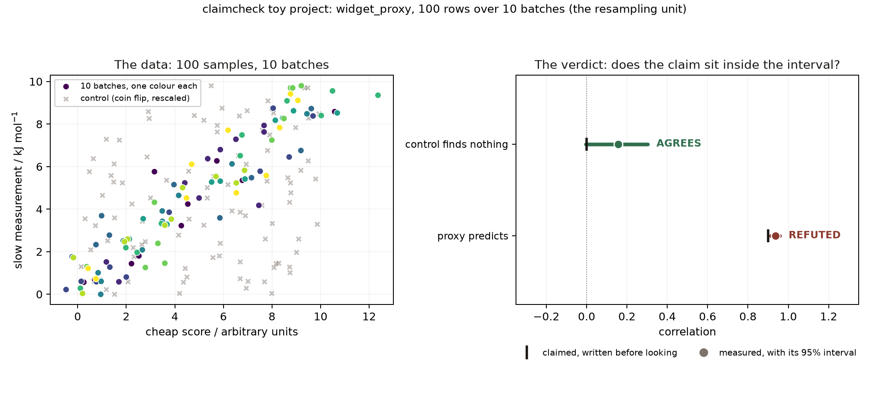

# claimcheck, explained with one toy project

You compute a number. Six months later somebody asks what it was, what it was
computed from, and whether it meant what you said. Usually the answer is a
filename and a shrug.

This repository is the smallest complete example of the alternative. Clone it,
run one command, and look at what comes out.

```bash
mamba env create -f environment.yml && mamba activate claimcheck-toy
snakemake -n      # read the job list first, always
snakemake -c4
```



## The idea, in one paragraph

**Write down what you expect before you look.** Afterwards the package
recomputes it from your data and tells you whether the two agreed. So instead of

> the correlation was 0.94

you get

> we predicted 0.9, measured 0.936 with a 95% interval of [0.912, 0.959]
> resampling over batches, and the prediction was **refuted** because the proxy
> is better than we said

Both sentences contain the same number. Only the second one can be wrong in a
way anybody would notice.

## The toy

One hundred samples in ten batches. Each sample has:

| column | what it is |
|---|---|
| `cheap_score` | a proxy that takes a second |
| `slow_measure_kJ` | the real measurement, which takes a day |
| `coin_flip` | a seeded random number. The control. |
| `batch` | which batch it came from |

The question a lab actually has: **can we screen on the cheap one and only pay
for the slow measurement on the promising samples?**

## What the run produces

```
results/claims.json       the verdicts
results/croissant.json    the data, in a format other tools read
results/graph.ttl         the claims and their provenance as RDF
results/dcat.ttl          the catalogue record
figures/verdicts.png      the picture above
```

And the verdicts themselves:

| | R1: the proxy | R2: the control |
|---|---|---|
| we claimed | 0.900 | 0.000 |
| we measured | **0.936** | **0.157** |
| 95% interval | [0.912, 0.959] | [-0.004, 0.303] |
| verdict | **REFUTED** | **AGREES** |

### Read the refutation carefully, because it is the whole point

R1 was **refuted**, and the proxy is **better** than we claimed. A verdict says
whether the data matched the prediction. It does not say whether the result is
good. People find this surprising for about thirty seconds and then never
misread a verdict again.

### And read the control, because it is why you can trust R1

`coin_flip` is pure noise, and it measured 0.157, not 0.000. Quote 0.157 on its
own and it looks like a faint signal. Its interval, [-0.004, 0.303], contains
zero, so it agrees, and the width of that interval is the most useful number on
the page: **on this design, any correlation below about 0.3 is indistinguishable
from noise.** That is what puts R1's 0.936 in proportion.

## Why the number of batches, not the number of samples

The interval is computed by resampling **batches**, because two samples from one
batch are not independent. Ten batches is the smallest number that works here.

An earlier version of this example used four batches. The noise control came back
"correlated" at r = 0.404 with an interval that excluded zero, which would have
been reported as a discovery. Nothing was broken; four independent units simply
cannot tell noise from signal. **The control is what revealed it**, which is the
argument for always having one.

## The three files that matter

### `context.toml`, the declaration

Four kinds of block and nothing else configures the package.

```toml
[project]     name, title, and what the project is about
[[datasets]]  where a file is, and whether a rule made it or a person did
[[variables]] one per column: its unit and what it means
[[relationships]]  the claims: x, y, method, and `claimed` before you look
```

An undeclared unit is not an oversight the package works around: every claim
touching that column comes back `unverifiable`. It will not guess, because
guessing would manufacture the exact fact it exists to notice is missing.

### `Snakefile`, the recipe

Nothing that computes a number runs outside it. Snakemake records, for every
output, the input digests, the code, the command, the environment and the times,
and that is the run record. Run the scripts by hand instead and `grading` will
tell you the numbers are not quotable:

```
$ python -m claimcheck.grading .
0 of 2 quotable (NONE: 2)      # before, when nothing had a rule
3 of 3 quotable (EXECUTED: 3)  # after `snakemake -c4`
```

The last five rules are not written in this file. They come from the package:

```python
from claimcheck.workflow import RULES as CLAIMCHECK_RULES
include: CLAIMCHECK_RULES
```

### `figures.py`, the picture

The figure is an output of a rule, beside the table, so the two cannot drift
apart. The right-hand panel is the thing that is hard to say in words and obvious
in a drawing: **a verdict is a claimed value falling inside or outside a
recomputed interval, and nothing else.**

## Three verdicts, and no others

| verdict | meaning |
|---|---|
| `agrees` | the claimed value lies inside the interval |
| `refuted` | it lies outside |
| `unverifiable` | no verdict could be reached: too few units, an undeclared unit, a column that will not parse |

**It is an interval, not a tolerance.** A claim sitting inside a very wide
interval is `unverifiable`, not confirmed. An earlier version of the package used
a tolerance, and on five rows it "falsified" both claims it was given.

## Where to go next

- `docs/TUTORIAL.md` in the [claimcheck repository](https://github.com/BenCree/claimcheck)
  walks through every function with runnable snippets.
- `context.toml` here is commented line by line and is the fastest way to see
  the shape of a real declaration.
- Change `claimed = 0.9` to `claimed = 0.94` and re-run. R1 will agree. That is
  the whole loop in one edit.

## One honest caveat

`simulate.py` generates the data, so the dataset is declared `origin =
"computed"`. In a real project the file arrives from a lab and is `manual`
instead, which makes `source`, `retrieved` and `sha256` required, because
Snakemake knows nothing about a file no rule produced and those are then the only
record there is. The `context.toml` here shows that block commented out beside
the real one.
