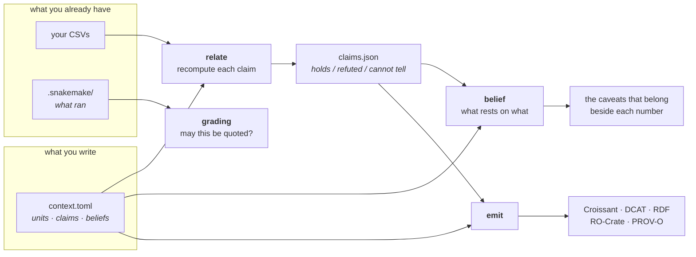
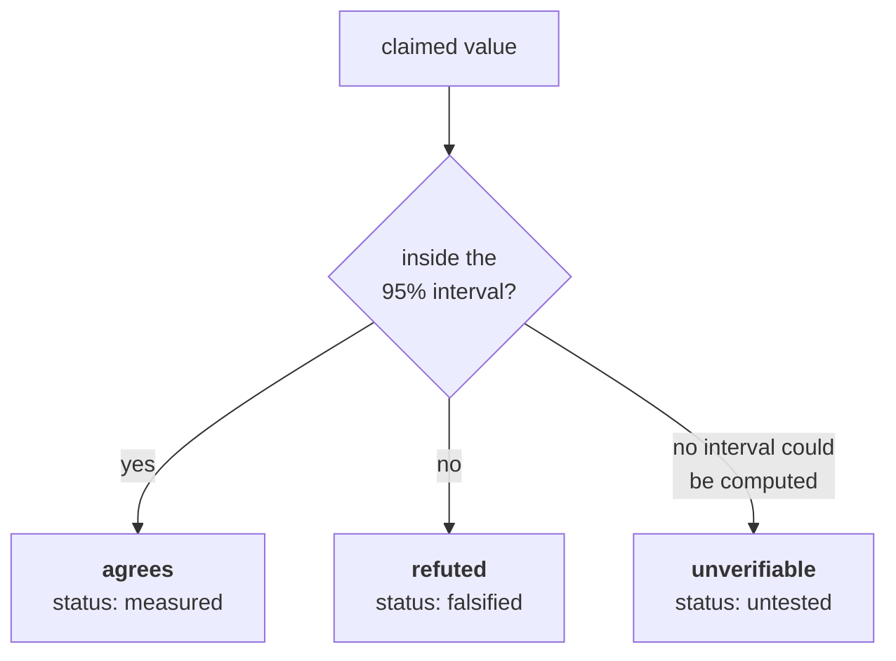
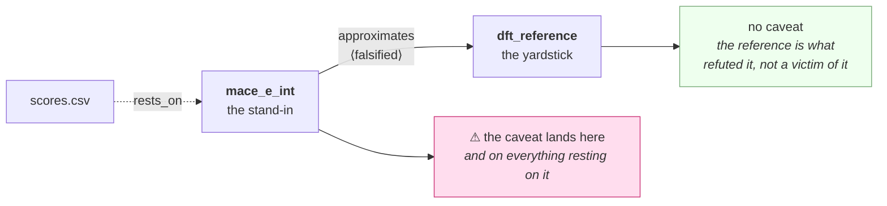
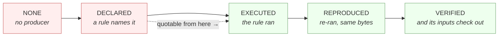

# claimcheck in ten minutes

> The short version. The full reference is [`../README.md`](../README.md).

**claimcheck recomputes the claims you make about your data, and refuses to
agree when the data cannot decide.**

You write a small text file next to your data. It says what each column is, what
unit it is in, and what you believe about it. claimcheck loads the data,
recomputes the number with a confidence interval, and answers **holds**,
**refuted**, or **cannot tell** — then publishes the dataset and the verdicts in
formats other tools already read.

---

## The idea in one picture



Four things, and only the first is unusual:

| | question it answers |
|---|---|
| **relate** | is the claim true of the data? |
| **belief** | if it is false, whose numbers must now say so? |
| **grading** | is this number recorded well enough to quote at all? |
| **emit** | can somebody else read all of it without asking you? |

---

## Quickstart

One file beside your data:

```toml
[project]
name = "my_study"

[[datasets]]
id = "mace"
origin = "computed"
files = ["data/mace.csv"]

[[variables]]
dataset = "mace"
name = "e_int_kcal"
unit = "kcal/mol"
meaning = "interaction energy, more negative is tighter"

[[variables]]
dataset = "mace"
name = "n_lig_atoms"
unit = "1"
meaning = "heavy atoms in the ligand"

[[relationships]]
x = "mace.e_int_kcal"
y = "mace.n_lig_atoms"
kind = "correlation"
method = "pearson"
claimed = 0.0                    # "size is not what this is measuring"
resampling_unit = "compound_group"
```

One command:

```console
$ python -m claimcheck.relate .
AGREES     mace.e_int_kcal ~ affinity.experimental_pKD
    claimed -0.5 lies within the 95% CI [-0.509, -0.388] for r = -0.450,
    resampling 493 compound_group(s)
REFUTED    mace.e_int_kcal ~ mace.n_lig_atoms
    claimed 0.0 lies OUTSIDE the 95% CI [-0.651, -0.525] for r = -0.589,
    resampling 493 compound_group(s)
```

The second claim was wrong: the score tracks ligand size after all.

---

## The three verdicts



**`unverifiable` is not a pass.** A claim inside an interval so wide it would
contain anything has not been confirmed — nothing was measured. The commonest
causes are a column with no declared unit, a constant column, and a table with
a header and no rows. Each is reported with the reason.

**`resampling_unit` is required and it is not a formality.** 493 poses of 60
compounds are not 493 independent observations. Declaring the unit is what makes
the interval mean anything, and claimcheck will not guess it for you.

---

## The part that is actually new: belief

Recomputing one claim is easy. The hard question is the second one — *something
was just refuted; which of my other numbers now need a warning?*

You declare a small graph of what rests on what:

```toml
[belief]

[belief.rests_on]
scores = "mace_e_int"            # this table rests on this method

[[belief.nodes]]
id = "mace_e_int"
kind = "method"
label = "MACE-OFF23 interaction energy"

[[belief.nodes]]
id = "dft_reference"
kind = "reference"
label = "wB97X-D3BJ, the yardstick"

[[belief.claims]]
subject = "mace_e_int"
predicate = "approximates"
object = "dft_reference"
status = "falsified"
evidence = "MAE 8.5 kcal/mol on 136 complexes"
```

and ask:

```console
$ python -m claimcheck.belief .
  scores (rests on mace_e_int): 1 caveat(s)
      [falsified] mace_e_int --approximates--> dft_reference
                we tested it and it is false
```

### Doubt travels one way, and that is the whole design



Delivering a refuted approximation to *both* ends is the obvious implementation
and it is wrong: it hands a warning to the reference, which the refutation
vindicates. On the graph this was measured against, that was 18 of 50
deliveries.

So every predicate declares **which end bears the doubt**, and separately
**which end goes stale** when the other changes. Twelve of the thirteen agree on
both. The thirteenth is why the two columns exist:

| predicate | goes stale | bears the doubt |
|---|---|---|
| `approximates` | the stand-in | the stand-in |
| `is_precondition_of` | the thing that needs it | the thing that needs it |
| `supersedes` | nothing | nobody — a replacement does not make the old numbers wrong |
| **`shares_approximation_with`** | **nothing** | **both ends** |

Two methods making the same assumption create no staleness at all — change one
and the other need not be recomputed — and total shared doubt: refute the
assumption and both fall together. That is also the honest reason their
agreement is **not** independent evidence.

---

## Is this number quotable?

`grading` reads Snakemake's own metadata store. It does not ask you.



`DECLARED` is below the line on purpose: **a rule describing an output is a
recipe, not a result.** It also finds files Snakemake recorded producing that
are no longer on disk — `--vanished`.

---

## Publishing

```console
$ python -m claimcheck.emit --list
  belief      what rests on what, and what a refutation puts in doubt
  croissant   MLCommons Croissant 1.1 — how to READ the dataset
  dcat        W3C DCAT — how to FIND the dataset, for a catalogue
  evi         EVI's propagation axioms, for a reasoner with no network
  graph       the claims and columns as RDF, joined to the digests
  jobs        PROV-O: why a run was launched, and what would have counted
  psdi        DCAT in PSDI's profile, checked against PSDI's own SHACL
  rocrate     RO-Crate 1.1 — the whole directory, named and hashed
```

Terms in one line each, because none of them is obvious:

- **Croissant** — MLCommons' description of a dataset: which files, which
  columns, what type. *How to read it.*
- **DCAT** — the W3C catalogue card: title, licence, publisher. *How to find it.*
- **RO-Crate** — a whole directory packaged with its metadata, named and hashed.
- **PROV-O** — the W3C way of saying who made what, from what, when.
- **SHACL** — a language for validating that a graph has the shape a profile
  requires.

Everything claimcheck emits uses somebody else's vocabulary wherever one exists.
`conform` then sweeps a directory of published records and asks whether a
consumer can actually **read** them — which is not the same as whether they
validate. A record that validated cleanly and yielded zero rows to a real loader
is the case that module was written for.

---

## The vocabulary, in miniature

Closed on purpose — a typo is refused at load rather than creating a phantom.

**7 statuses.**

| status | meaning | evidence |
|---|---|---|
| `measured` | somebody measured it | **required** |
| `published` | somebody else measured it | **required** |
| `contested` | evidence on both sides | **required** |
| `falsified` | tested, and false. A **result**, not a gap | **required** |
| `by_construction` | true by how the thing is built | optional |
| `assumed` | a bet nobody has tested | optional |
| `untested` | nobody has looked | **forbidden** |

`untested` forbidding evidence is not pedantry: if somebody looked, say what
they found. A claim quietly settled and never restated is a stale number one
field earlier.

**7 node kinds** — method · reference · parameter · condition · quantity ·
representation · strategy

**13 predicates** — the four in the table above, plus
`is_cheaper_surrogate_for`, `is_distilled_from`, `depends_on`,
`is_validated_against`, `preserves_ordering_of`, `rescues_ranking_errors_of`,
`is_invalidated_by`, `dominates_error_of`, `displaces_ranking_more_than`.

---

## Three refusals that are the point

claimcheck stops rather than answering when answering would mislead. These are
the ones you will meet:

**A claim that names a verdict file that is not there.** If a claim says
`tested_by = "x ~ y"`, its status comes from the recomputation — so reporting
the hand-written status instead would publish a belief nobody checked.

**An artefact declared to rest on nothing.** `caveats_on()` returns an empty
list both for *"not joined to the graph"* and for *"joined, nothing in doubt"*.
A caller that cannot tell those apart prints a clean bill of health for a name
that does not exist, so `knows()` answers the first question separately.

**A number with no unit.** Every relationship touching that column comes back
`unverifiable`. It is not guessed, because a slope between two undeclared
quantities is not comparable with anyone else's.

---

## Installing

```bash
pip install claimcheck                    # the core — standard library only
pip install 'claimcheck[graph]'           # + rdflib: RDF, DCAT, PROV-O
pip install 'claimcheck[psdi,rocrate]'    # + validators for those two profiles
```

**11 of the 18 modules import nothing beyond the standard library**, including
`relate`, `belief` and `croissant`. That is checked by running them behind an
import hook that refuses every third-party package — because the question *what
else is in doubt?* gets asked when something has already gone wrong, which is
exactly when the optional extras are what is missing.

---

## Starting

```bash
python -m claimcheck.scaffold my_study    # writes context.toml + a Snakefile
cd my_study && snakemake -n               # always the dry run first
snakemake -c1
```

The generated Snakefile is ordinary Snakemake with nothing added. claimcheck
never executes your pipeline and never writes a record of a run — Snakemake's
metadata store already is one, and its own test suite mechanically refuses any
function that looks like it is writing a second.

---

## What it does not do

- **It does not run your analysis.** Snakemake does; claimcheck reads what
  Snakemake recorded.
- **It does not decide what is worth claiming.** An experiment nobody has run
  is work not done, not an error, and nothing here manufactures one.
- **It does not put your rows in a graph.** A million rows is five million
  triples answering no question a CSV reader could not. The graph carries the
  *columns* and the *claims*; the numbers stay in the file and are joined by
  digest.
